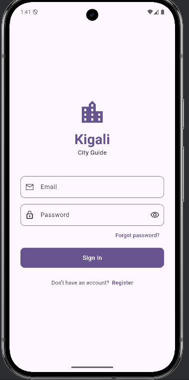
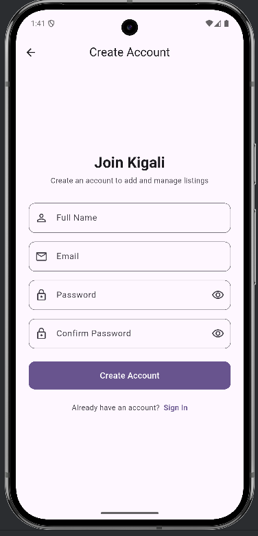
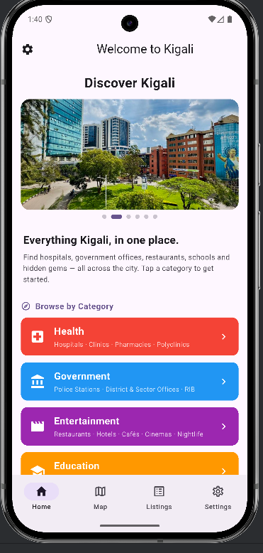
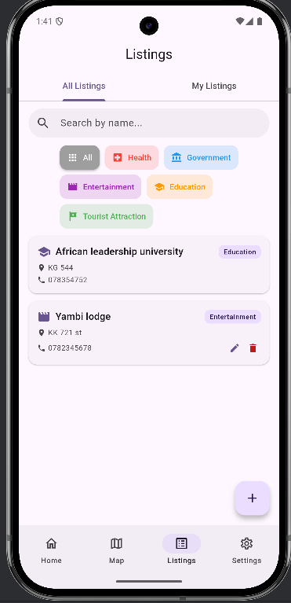
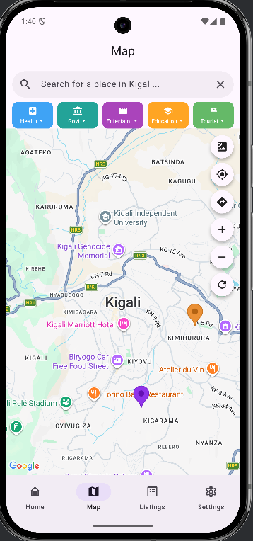
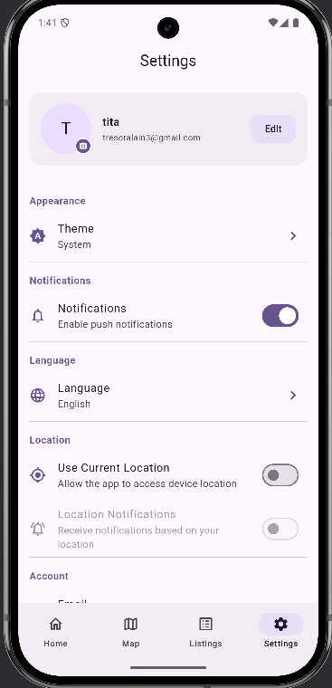

# Kigali City Guide

A Flutter-based city directory and guide application for Kigali, Rwanda. Users can discover, browse, and add local listings across five key categories, view them on an interactive map, get driving directions, read and write reviews, and manage their own submissions all in six languages.

## Screenshots

| Login | Register | Home |
|-------|----------|------|
|  |  |  |

| Listings | Map | Settings |
|----------|-----|----------|
|  |  |  |

## Features

### Directory & Listings
- Browse places and services across **5 categories**: Health, Government, Entertainment, Education, and Tourist Attraction
- Each category has dedicated subcategories (e.g. Health → Hospitals, Clinics, Pharmacies; Tourist Attraction → Museums, Genocide Memorials, Parks)
- Real-time Firestore listener keeps listings updated automatically across all screens
- Full-text search and category filtering on the listings screen
- **My Listings** tab to manage your own submissions

### Interactive Map
- Full-screen Google Map centred on Kigali
- Colour-coded markers per category, filterable by category/subcategory chips
- Live place search powered by the free [Nominatim OSM API](https://nominatim.openstreetmap.org) (no API key required)
- Driving route planning via [OSRM](https://router.project-osrm.org) drawn as a polyline  no billing required
- Camera animates to the user's GPS location
- Street view / satellite map type toggle

### Listing Details
- Expandable hero image from Firebase Storage (falls back to a category gradient with icon)
- One-tap phone call via `tel:` URI
- External Google Maps directions
- Inline lite-mode mini-map showing the listing's pin
- Real-time **reviews** with star ratings (average rating displayed; duplicate-review prevention logic exists in the provider but is not yet enforced in the UI)

### Listing Management
- Create or edit listings with: Name, Category, Subcategory, Address, Contact Number, Description, and Photo
- Photo picked from camera or gallery (resized to max 1024 px, 75% quality before upload)
- Address automatically geocoded to lat/lng via Nominatim (bounded to Kigali viewport)
- Image uploaded to Firebase Storage
- Edit and delete locked to the original creator

### Authentication
- Email & password sign-in, registration, and forgot-password flow
- All Firebase error codes mapped to localised, user-friendly messages
- Profile card with editable display name, synced to Firebase Auth and Firestore

### Settings
- Light / Dark / System theme
- 6-language localisation: English, French, Kinyarwanda, Swahili, German, Spanish
- Push notification toggle (FCM token stored in Firestore)
- Location access and location-based notification toggles
- All settings persisted via `SharedPreferences`

---

## Tech Stack

### Framework & Language
- **Flutter** (Dart)  multi-platform (Android, iOS, Web, macOS, Windows)

### Backend / Cloud
| Service | Purpose |
|---|---|
| Firebase Auth | Email/password authentication, display name management |
| Cloud Firestore | Real-time listings, reviews subcollection, user profiles |
| Firebase Storage | Listing photo uploads |
| Firebase Messaging | FCM push notification token capture |

### Key Packages
| Package | Purpose |
|---|---|
| `google_maps_flutter ^2.9.0` | Interactive map, markers, polylines, lite-mode mini-maps |
| `geolocator ^14.0.2` | Device GPS location and permissions |
| `http ^1.6.0` | Nominatim geocoding and OSRM routing API calls |
| `image_picker ^1.1.2` | Camera and gallery photo selection |
| `url_launcher ^6.3.1` | Phone calls and external Google Maps links |
| `shared_preferences ^2.3.2` | Settings persistence |
| `flutter_localizations` | i18n framework delegates |

### State Management
No third-party state management library is used. The app relies entirely on Flutter's built-in primitives:

| Class | Role |
|---|---|
| `ListingsProvider` (extends `ChangeNotifier`) | Owns all Firestore data: the listings list, active search query, selected category filter, loading/error state, and methods for CRUD, reviews, and user-profile updates. |
| `SettingsProvider` (extends `ChangeNotifier`) | Owns all user preferences: theme mode, locale, notification toggles, and location permission state. Persists every setting via `SharedPreferences`. |
| `ListingsScope` (extends `InheritedNotifier<ListingsProvider>`) | Propagates `ListingsProvider` down the widget tree without requiring a package dependency. Widgets call `ListingsScope.of(context)` to read or mutate listings state. |
| `SettingsScope` (extends `InheritedNotifier<SettingsProvider>`) | Propagates `SettingsProvider` the same way, scoping theme and locale changes to the entire `MaterialApp`. |

Both providers are instantiated once in `main.dart` and injected at the root of the widget tree. The Firestore real-time listener inside `ListingsProvider` is started/stopped in response to `FirebaseAuth.authStateChanges()`, preventing data leaks when the user signs out.

---

## Project Structure

```
lib/
├── main.dart                   # App entry point, Firebase init, FCM setup, auth gate
├── main_navigation.dart        # Bottom nav (Home, Map, Listings, Settings)
├── firebase_options.dart       # Firebase platform configuration
│
├── models/
│   ├── listing.dart            # Listing model with categories & subcategories
│   └── review.dart             # Review model (rating + comment)
│
├── providers/
│   ├── listings_provider.dart  # Real-time Firestore CRUD, reviews, user profile
│   └── settings_provider.dart  # Theme, locale, notifications, location preferences
│
├── screens/
│   ├── sign_in.dart            # Email/password sign-in + forgot password
│   ├── register.dart           # New user registration
│   ├── home.dart               # Animated carousel + category entry tiles
│   ├── category.dart           # Filtered listing view per category
│   ├── map.dart                # Google Map with search, routing, and markers
│   ├── listing_detail.dart     # Full listing detail + mini-map + reviews
│   ├── listing_form.dart       # Create / edit listing form with geocoding
│   ├── my_listing.dart         # All listings + My Listings tabs with filters
│   ├── directory.dart          # Full directory with search and filter chips
│   └── settings.dart           # Theme, language, notifications, profile, logout
│
└── localisation/
    └── app_localizations.dart  # 6-language string map (EN, FR, RW, SW, DE, ES)
```

---

## Getting Started

### Prerequisites
- [Flutter SDK](https://docs.flutter.dev/get-started/install) (3.x or later)
- A Firebase project with Auth, Firestore, Storage, and Messaging enabled
- A Google Maps API key with the **Maps SDK for Android** (and/or iOS) enabled

### Setup

1. **Clone the repository**
   ```bash
   git clone <repository-url>
   cd kigali
   ```

2. **Install dependencies**
   ```bash
   flutter pub get
   ```

3. **Configure Firebase**
   - Follow the [FlutterFire setup guide](https://firebase.flutter.dev/docs/overview) to connect your Firebase project.
   - Place the generated `google-services.json` in `android/app/`.
   - Place `GoogleService-Info.plist` in `ios/Runner/`.

4. **Add your Google Maps API key**

   *Android* — in `android/app/src/main/AndroidManifest.xml`:
   ```xml
   <meta-data
     android:name="com.google.android.geo.API_KEY"
     android:value="YOUR_API_KEY"/>
   ```

   *iOS* — in `ios/Runner/AppDelegate.swift`:
   ```swift
   GMSServices.provideAPIKey("YOUR_API_KEY")
   ```

5. **Run the app**
   ```bash
   flutter run
   ```

---

## Firestore Data Model

```
listings/                         ← top-level collection
  {listingId}/
    name          String
    category      String
    subcategory   String
    address       String
    contactNumber String
    description   String
    latitude      double
    longitude     double
    createdBy     String (UID)
    timestamp     Timestamp
    imageUrl      String (Storage URL)

    reviews/                      ← subcollection
      {reviewId}/
        userId    String (UID)
        userName  String
        rating    double
        comment   String
        timestamp Timestamp

users/                            ← user profiles
  {uid}/
    displayName   String
    email         String
    createdAt     Timestamp
    fcmToken      String

Firebase Storage paths:
  listings/{listingId}.jpg          ← listing photos
  user_photos/{uid}.jpg             ← profile photos (set via Firebase Auth photoURL)
```

---

## Supported Languages

| Code | Language |
|---|---|
| `en` | English |
| `fr` | French |
| `rw` | Kinyarwanda |
| `sw` | Swahili |
| `de` | German |
| `es` | Spanish |

Language selection is available in **Settings** and persists across sessions.

---

## Listing Categories

| Category | Colour | Example Subcategories |
|---|---|---|
| Health | Red | Hospitals, Clinics, Pharmacies, Labs |
| Government | Blue | Embassies, Police Stations, Immigration |
| Entertainment | Purple | Restaurants, Cafes, Hotels, Nightlife |
| Education | Orange | Universities, Schools, Libraries, Training |
| Tourist Attraction | Green | Museums, Genocide Memorials, Parks, Markets |

---

## License

This project was developed as part of an individual mobile development module.

- [Lab: Write your first Flutter app](https://docs.flutter.dev/get-started/codelab)
- [Cookbook: Useful Flutter samples](https://docs.flutter.dev/cookbook)

For help getting started with Flutter development, view the
[online documentation](https://docs.flutter.dev/), which offers tutorials,
samples, guidance on mobile development, and a full API reference.
